# Kreative Vexillo

Kreative Vexillo is a repository of images of flags in various formats, sizes, and aspect ratios, as well as the XML files used to describe them and the computer programs used to generate them.

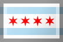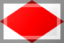

Flags are named according to ISO 3166-1 alpha-2 country codes. Flags are present for all officially assigned codes as well as many exceptionally reserved, transitionally reserved, and user-assigned codes. Many other flags are included, among them ICS and NATO signal flags, pride flags, and flags for constructed languages.

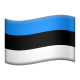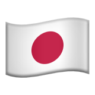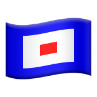

Kreative Vexillo contains **over 600 flags**. For comparison, the [My'file flag icon set](http://www.kreativekorp.com/lib/flags/) contains **300 flags** and the original [FamFamFam flag icon set](http://www.famfamfam.com/lab/icons/flags/) contains **247 flags**.

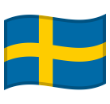

The flag images and the XML files used to describe them are placed in the public domain, free to use for any purpose with no requirement for attribution, except where otherwise noted within the XML file. The source code and binaries used to produce them, as well as any other computer programs in this repository including digital font files, are released under the Mozilla Public License.

## Browse or Download Flag Images

Open the [Kreative Vexillo web app](http://www.kreativekorp.com/app/vexillo/) to browse and download flag images.

----

# Roadmap to Flag Images

## Flags for ISO Country Codes

<table align="center"><tr><td>                                                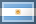                                                                                                                                                                                                                                                                                                                                                                                                                                                                                                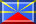                                                                                                                                                                                                                                                              </td></tr></table>

User-assigned codes are assigned according to actual use:

  * CLDR uses `QU` to represent the European Union.
  * Switzerland uses `XA` to represent the Canary Islands.
  * Several organizations use `XK` to represent Kosovo.
  * WhatsApp uses `XE`, `XS`, and `XW` to represent England, Scotland, and Wales, respectively.
  * `ZZ` is often used for an unknown or invalid territory.

## ICS, NATO, Esperanto, and Other Signal Flags

<table align="center"><tr><th colspan="3">ICS</th><th>NATO</th><th>Repeaters</th><th>Miscellaneous</th></tr><tr><td rowspan="3">  A    B    C    D    E    F    G    H    I    J    K    L    M </td><td rowspan="3">  N    O    P    Q    R    S    T    U    V    W    X    Y    Z </td><td rowspan="3">  1    2    3    4    5    6    7    8    9    0    CA </td><td rowspan="3">  1    2    3    4    5    6    7    8    9    0    </td><td>  1R    2R    3R    4R </td><td rowspan="3">  Semaphore    Semaphore (Japan, Left Hand)    Semaphore (Japan, Right Hand)    Small Craft / Gale Warning (USA)    Whole Gale / Storm Warning (USA)    Diver Down (USA)    Distress Signal (USA) </td></tr><tr><th>Esperanto</th></tr><tr><td>  Ĉ    Ĝ    Ĥ    Ĵ    Ŝ    Ŭ </td></tr></table>

Codes for ICS, NATO, and Esperanto signal flags are of the form `xx-ics-`*letter*, `xx-ics-`*number*, `xx-nato-`*number*, or `xx-esperanto-`*letter*.

## Generic Flags

<table align="center"><tr><td>                                                                      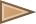                        </td></tr></table>

Codes for generic flags are of the form `xx-generic-`*color* or `xx-generic-`*color*`-`*style*.

## ISO Country Code Subdivisions

<table align="center"><tr><td valign="top"><table align="center">
<tr><td></td><td><code>aq-bartram</code></td><td>Antarctica (Graham Bartram Prop.)</td></tr>
<tr><td></td><td><code>aq-emblem</code></td><td>Antarctica (Antarctic Treaty System)</td></tr>
<tr><td></td><td><code>aq-smith</code></td><td>Antarctica (Whitney Smith Proposal)</td></tr>
<tr><td></td><td><code>at-1</code></td><td>Burgenland</td></tr>
<tr><td></td><td><code>at-2</code></td><td>Carinthia</td></tr>
<tr><td></td><td><code>at-3</code></td><td>Lower Austria</td></tr>
<tr><td></td><td><code>at-4</code></td><td>Upper Austria</td></tr>
<tr><td></td><td><code>at-5</code></td><td>Salzburg</td></tr>
<tr><td></td><td><code>at-6</code></td><td>Styria</td></tr>
<tr><td></td><td><code>at-7</code></td><td>Tyrol</td></tr>
<tr><td></td><td><code>at-8</code></td><td>Vorarlberg</td></tr>
<tr><td></td><td><code>at-9</code></td><td>Vienna</td></tr>
<tr><td></td><td><code>au-aboriginal</code></td><td>Australian Aboriginal</td></tr>
<tr><td></td><td><code>bq-bo</code></td><td>Bonaire</td></tr>
<tr><td></td><td><code>bq-sa</code></td><td>Saba</td></tr>
<tr><td></td><td><code>bq-se</code></td><td>Sint Eustatius</td></tr>
<tr><td></td><td><code>ca-ab</code></td><td>Alberta</td></tr>
<tr><td></td><td><code>ca-bc</code></td><td>British Columbia</td></tr>
<tr><td></td><td><code>ca-mb</code></td><td>Manitoba</td></tr>
<tr><td></td><td><code>ca-nb</code></td><td>New Brunswick</td></tr>
<tr><td></td><td><code>ca-nl</code></td><td>Newfoundland and Labrador</td></tr>
<tr><td></td><td><code>ca-ns</code></td><td>Nova Scotia</td></tr>
<tr><td></td><td><code>ca-nt</code></td><td>Northwest Territories</td></tr>
<tr><td></td><td><code>ca-nu</code></td><td>Nunavut</td></tr>
<tr><td></td><td><code>ca-on</code></td><td>Ontario</td></tr>
<tr><td></td><td><code>ca-pe</code></td><td>Prince Edward Island</td></tr>
<tr><td></td><td><code>ca-qc</code></td><td>Quebec</td></tr>
<tr><td></td><td><code>ca-sk</code></td><td>Saskatchewan</td></tr>
<tr><td></td><td><code>ca-yt</code></td><td>Yukon</td></tr>
<tr><td></td><td><code>ca-labrador</code></td><td>Labrador</td></tr>
<tr><td></td><td><code>ca-newfoundland</code></td><td>Newfoundland Tricolor</td></tr>
<tr><td></td><td><code>ch-ag</code></td><td>Aargau</td></tr>
<tr><td></td><td><code>ch-ai</code></td><td>Appenzell Innerrhoden</td></tr>
<tr><td>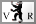</td><td><code>ch-ar</code></td><td>Appenzell Ausserrhoden</td></tr>
<tr><td></td><td><code>ch-be</code></td><td>Bern</td></tr>
<tr><td></td><td><code>ch-bl</code></td><td>Basel-Landschaft</td></tr>
<tr><td></td><td><code>ch-bs</code></td><td>Basel-Stadt</td></tr>
<tr><td></td><td><code>ch-fr</code></td><td>Fribourg</td></tr>
<tr><td></td><td><code>ch-ge</code></td><td>Geneva</td></tr>
<tr><td></td><td><code>ch-gl</code></td><td>Glarus</td></tr>
<tr><td></td><td><code>ch-gr</code></td><td>Graubünden</td></tr>
<tr><td></td><td><code>ch-ju</code></td><td>Jura</td></tr>
<tr><td></td><td><code>ch-lu</code></td><td>Lucerne</td></tr>
<tr><td></td><td><code>ch-ne</code></td><td>Neuchâtel</td></tr>
<tr><td></td><td><code>ch-nw</code></td><td>Nidwalden</td></tr>
<tr><td></td><td><code>ch-ow</code></td><td>Obwalden</td></tr>
<tr><td></td><td><code>ch-sg</code></td><td>Sankt Gallen</td></tr>
<tr><td></td><td><code>ch-sh</code></td><td>Schaffhausen</td></tr>
<tr><td></td><td><code>ch-so</code></td><td>Solothurn</td></tr>
<tr><td></td><td><code>ch-sz</code></td><td>Schwyz</td></tr>
<tr><td></td><td><code>ch-tg</code></td><td>Thurgau</td></tr>
<tr><td></td><td><code>ch-ti</code></td><td>Ticino</td></tr>
<tr><td></td><td><code>ch-ur</code></td><td>Uri</td></tr>
<tr><td></td><td><code>ch-vd</code></td><td>Vaud</td></tr>
<tr><td></td><td><code>ch-vs</code></td><td>Valais</td></tr>
<tr><td></td><td><code>ch-zg</code></td><td>Zug</td></tr>
<tr><td></td><td><code>ch-zh</code></td><td>Zürich</td></tr>
<tr><td></td><td><code>dk-040</code></td><td>Bornholm</td></tr>
<tr><td></td><td><code>de-bb</code></td><td>Brandenburg</td></tr>
<tr><td></td><td><code>de-be</code></td><td>Berlin</td></tr>
<tr><td></td><td><code>de-bw</code></td><td>Baden-Württemberg</td></tr>
<tr><td></td><td><code>de-by</code></td><td>Bavaria</td></tr>
<tr><td></td><td><code>de-by-r</code></td><td>Bavaria (Lozenge Flag)</td></tr>
<tr><td></td><td><code>de-by-s</code></td><td>Bavaria (Striped Flag)</td></tr>
<tr><td></td><td><code>de-hb</code></td><td>Bremen</td></tr>
<tr><td></td><td><code>de-he</code></td><td>Hesse</td></tr>
<tr><td></td><td><code>de-hh</code></td><td>Hamburg</td></tr>
<tr><td></td><td><code>de-mv</code></td><td>Mecklenburg-Western Pomerania</td></tr>
<tr><td></td><td><code>de-ni</code></td><td>Lower Saxony</td></tr>
<tr><td></td><td><code>de-nw</code></td><td>North Rhine-Westphalia</td></tr>
<tr><td></td><td><code>de-rp</code></td><td>Rhineland-Palatinate</td></tr>
<tr><td></td><td><code>de-sh</code></td><td>Schleswig-Holstein</td></tr>
<tr><td></td><td><code>de-sl</code></td><td>Saarland</td></tr>
<tr><td></td><td><code>de-sn</code></td><td>Saxony</td></tr>
<tr><td></td><td><code>de-st</code></td><td>Saxony-Anhalt</td></tr>
<tr><td></td><td><code>de-th</code></td><td>Thuringia</td></tr>
<tr><td></td><td><code>es-cn</code></td><td>Canary Islands</td></tr>
<tr><td></td><td><code>es-ct</code></td><td>Catalonia</td></tr>
<tr><td></td><td><code>es-md</code></td><td>Community of Madrid</td></tr>
<tr><td></td><td><code>es-pv</code></td><td>Basque Country</td></tr>
<tr><td></td><td><code>fm-ksa</code></td><td>Kosrae</td></tr>
<tr><td></td><td><code>fm-pni</code></td><td>Pohnpei</td></tr>
<tr><td></td><td><code>fm-trk</code></td><td>Chuuk</td></tr>
<tr><td></td><td><code>fm-yap</code></td><td>Yap</td></tr>
<tr><td></td><td><code>fr-50</code></td><td>Manche</td></tr>
<tr><td></td><td><code>fr-bre</code></td><td>Brittany</td></tr>
<tr><td></td><td><code>fr-e</code></td><td>Brittany</td></tr>
<tr><td></td><td><code>fr-nor</code></td><td>Normandy</td></tr>
<tr><td></td><td><code>fr-p</code></td><td>Normandy</td></tr>
<tr><td></td><td><code>fr-q</code></td><td>Normandy</td></tr>
<tr><td></td><td><code>gb-eng</code></td><td>England</td></tr>
<tr><td></td><td><code>gb-nir</code></td><td>Northern Ireland</td></tr>
<tr><td></td><td><code>gb-ork</code></td><td>Orkney Islands</td></tr>
<tr><td></td><td><code>gb-sct</code></td><td>Scotland</td></tr>
<tr><td></td><td><code>gb-wls</code></td><td>Wales</td></tr>
<tr><td></td><td><code>gb-zet</code></td><td>Shetland Islands</td></tr>
<tr><td></td><td><code>gp-black</code></td><td>Guadeloupe (Black Local Variant)</td></tr>
<tr><td></td><td><code>gp-red</code></td><td>Guadeloupe (Red Local Variant)</td></tr>
<tr><td></td><td><code>gp-uplg</code></td><td>Guadeloupe (UPLG)</td></tr>
<tr><td></td><td><code>iq-kr</code></td><td>Iraqi Kurdistan</td></tr>
<tr><td></td><td><code>it-82</code></td><td>Sicily</td></tr>
<tr><td></td><td><code>jp-01</code></td><td>Hokkaido</td></tr>
<tr><td></td><td><code>jp-02</code></td><td>Aomori</td></tr>
<tr><td></td><td><code>jp-03</code></td><td>Iwate</td></tr>
<tr><td></td><td><code>jp-04</code></td><td>Miyagi</td></tr>
<tr><td></td><td><code>jp-05</code></td><td>Akita</td></tr>
<tr><td></td><td><code>jp-06</code></td><td>Yamagata</td></tr>
<tr><td></td><td><code>jp-07</code></td><td>Fukushima</td></tr>
<tr><td></td><td><code>jp-08</code></td><td>Ibaraki</td></tr>
<tr><td></td><td><code>jp-09</code></td><td>Tochigi</td></tr>
<tr><td></td><td><code>jp-10</code></td><td>Gunma</td></tr>
<tr><td></td><td><code>jp-11</code></td><td>Saitama</td></tr>
<tr><td></td><td><code>jp-12</code></td><td>Chiba</td></tr>
<tr><td></td><td><code>jp-13</code></td><td>Tokyo</td></tr>
<tr><td></td><td><code>jp-14</code></td><td>Kanagawa</td></tr>
<tr><td></td><td><code>jp-15</code></td><td>Niigata</td></tr>
<tr><td></td><td><code>jp-16</code></td><td>Toyama</td></tr>
<tr><td></td><td><code>jp-17</code></td><td>Ishikawa</td></tr>
<tr><td></td><td><code>jp-18</code></td><td>Fukui</td></tr>
<tr><td></td><td><code>jp-19</code></td><td>Yamanashi</td></tr>
<tr><td></td><td><code>jp-20</code></td><td>Nagano</td></tr>
<tr><td></td><td><code>jp-21</code></td><td>Gifu</td></tr>
<tr><td></td><td><code>jp-22</code></td><td>Shizuoka</td></tr>
<tr><td></td><td><code>jp-23</code></td><td>Aichi</td></tr>
<tr><td></td><td><code>jp-24</code></td><td>Mie</td></tr>
<tr><td></td><td><code>jp-25</code></td><td>Shiga</td></tr>
<tr><td></td><td><code>jp-26</code></td><td>Kyoto</td></tr>
<tr><td></td><td><code>jp-27</code></td><td>Osaka</td></tr>
<tr><td></td><td><code>jp-28</code></td><td>Hyogo</td></tr>
<tr><td></td><td><code>jp-29</code></td><td>Nara</td></tr>
<tr><td></td><td><code>jp-30</code></td><td>Wakayama</td></tr>
<tr><td></td><td><code>jp-31</code></td><td>Tottori</td></tr>
<tr><td></td><td><code>jp-32</code></td><td>Shimane</td></tr>
<tr><td></td><td><code>jp-33</code></td><td>Okayama</td></tr>
<tr><td></td><td><code>jp-34</code></td><td>Hiroshima</td></tr>
<tr><td></td><td><code>jp-35</code></td><td>Yamaguchi</td></tr>
<tr><td></td><td><code>jp-36</code></td><td>Tokushima</td></tr>
<tr><td></td><td><code>jp-37</code></td><td>Kagawa</td></tr>
<tr><td></td><td><code>jp-38</code></td><td>Ehime</td></tr>
<tr><td></td><td><code>jp-39</code></td><td>Kochi</td></tr>
<tr><td></td><td><code>jp-40</code></td><td>Fukuoka</td></tr>
<tr><td></td><td><code>jp-41</code></td><td>Saga</td></tr>
<tr><td></td><td><code>jp-42</code></td><td>Nagasaki</td></tr>
<tr><td></td><td><code>jp-43</code></td><td>Kumamoto</td></tr>
<tr><td></td><td><code>jp-44</code></td><td>Oita</td></tr>
<tr><td></td><td><code>jp-45</code></td><td>Miyazaki</td></tr>
<tr><td></td><td><code>jp-46</code></td><td>Kagoshima</td></tr>
<tr><td></td><td><code>jp-47</code></td><td>Okinawa</td></tr>
<tr><td></td><td><code>jp-hnd</code></td><td>Tokyo City</td></tr>
<tr><td></td><td><code>jp-itm</code></td><td>Osaka City</td></tr>
<tr><td></td><td><code>jp-uky</code></td><td>Kyoto City</td></tr>
<tr><td></td><td><code>km-a</code></td><td>Anjouan</td></tr>
<tr><td></td><td><code>km-g</code></td><td>Grande Comore</td></tr>
<tr><td></td><td><code>km-m</code></td><td>Mohéli</td></tr>
<tr><td></td><td><code>nl-ams</code></td><td>Amsterdam</td></tr>
<tr><td></td><td><code>nl-bq1</code></td><td>Bonaire</td></tr>
<tr><td></td><td><code>nl-bq2</code></td><td>Saba</td></tr>
<tr><td></td><td><code>nl-bq3</code></td><td>Sint Eustatius</td></tr>
<tr><td></td><td><code>nz-krikienoid</code></td><td>New Zealand (Krikienoid Proposal)</td></tr>
<tr><td></td><td><code>nz-laserkiwi</code></td><td>New Zealand (Laser Kiwi Proposal)</td></tr>
<tr><td></td><td><code>nz-redpeak</code></td><td>New Zealand (Red Peak Proposal)</td></tr>
<tr><td></td><td><code>pe-cus</code></td><td>Cusco</td></tr>
<tr><td></td><td><code>se-12</code></td><td>Scania</td></tr>
<tr><td></td><td><code>se-m</code></td><td>Scania</td></tr>
<tr><td></td><td><code>sy-snc</code></td><td>Syrian National Coalition</td></tr>
<tr><td></td><td><code>uk-eng</code></td><td>England</td></tr>
<tr><td></td><td><code>uk-nir</code></td><td>Northern Ireland</td></tr>
<tr><td></td><td><code>uk-ork</code></td><td>Orkney Islands</td></tr>
<tr><td></td><td><code>uk-sct</code></td><td>Scotland</td></tr>
<tr><td></td><td><code>uk-wls</code></td><td>Wales</td></tr>
<tr><td></td><td><code>uk-zet</code></td><td>Shetland Islands</td></tr>
</table></td><td valign="top"><table align="center">
<tr><td></td><td><code>us-ak</code></td><td>Alaska</td></tr>
<tr><td></td><td><code>us-al</code></td><td>Alabama</td></tr>
<tr><td></td><td><code>us-ar</code></td><td>Arkansas</td></tr>
<tr><td></td><td><code>us-az</code></td><td>Arizona</td></tr>
<tr><td></td><td><code>us-ca</code></td><td>California</td></tr>
<tr><td></td><td><code>us-co</code></td><td>Colorado</td></tr>
<tr><td></td><td><code>us-ct</code></td><td>Connecticut</td></tr>
<tr><td></td><td><code>us-dc</code></td><td>District of Columbia</td></tr>
<tr><td></td><td><code>us-de</code></td><td>Delaware</td></tr>
<tr><td></td><td><code>us-fl</code></td><td>Florida</td></tr>
<tr><td></td><td><code>us-ga</code></td><td>Georgia</td></tr>
<tr><td></td><td><code>us-hi</code></td><td>Hawaii</td></tr>
<tr><td></td><td><code>us-ia</code></td><td>Iowa</td></tr>
<tr><td></td><td><code>us-id</code></td><td>Idaho</td></tr>
<tr><td></td><td><code>us-il</code></td><td>Illinois</td></tr>
<tr><td></td><td><code>us-in</code></td><td>Indiana</td></tr>
<tr><td></td><td><code>us-ks</code></td><td>Kansas</td></tr>
<tr><td></td><td><code>us-ky</code></td><td>Kentucky</td></tr>
<tr><td></td><td><code>us-la</code></td><td>Louisiana</td></tr>
<tr><td></td><td><code>us-ma</code></td><td>Massachusetts</td></tr>
<tr><td></td><td><code>us-md</code></td><td>Maryland</td></tr>
<tr><td></td><td><code>us-me</code></td><td>Maine</td></tr>
<tr><td></td><td><code>us-mi</code></td><td>Michigan</td></tr>
<tr><td></td><td><code>us-mn</code></td><td>Minnesota</td></tr>
<tr><td></td><td><code>us-mo</code></td><td>Missouri</td></tr>
<tr><td></td><td><code>us-ms</code></td><td>Mississippi</td></tr>
<tr><td></td><td><code>us-mt</code></td><td>Montana</td></tr>
<tr><td></td><td><code>us-nc</code></td><td>North Carolina</td></tr>
<tr><td></td><td><code>us-nd</code></td><td>North Dakota</td></tr>
<tr><td></td><td><code>us-ne</code></td><td>Nebraska</td></tr>
<tr><td></td><td><code>us-nh</code></td><td>New Hampshire</td></tr>
<tr><td></td><td><code>us-nj</code></td><td>New Jersey</td></tr>
<tr><td></td><td><code>us-nm</code></td><td>New Mexico</td></tr>
<tr><td></td><td><code>us-ny</code></td><td>New York</td></tr>
<tr><td></td><td><code>us-nv</code></td><td>Nevada</td></tr>
<tr><td></td><td><code>us-oh</code></td><td>Ohio</td></tr>
<tr><td></td><td><code>us-ok</code></td><td>Oklahoma</td></tr>
<tr><td></td><td><code>us-or</code></td><td>Oregon</td></tr>
<tr><td></td><td><code>us-pa</code></td><td>Pennsylvania</td></tr>
<tr><td></td><td><code>us-ri</code></td><td>Rhode Island</td></tr>
<tr><td></td><td><code>us-sc</code></td><td>South Carolina</td></tr>
<tr><td></td><td><code>us-sd</code></td><td>South Dakota</td></tr>
<tr><td></td><td><code>us-tn</code></td><td>Tennessee</td></tr>
<tr><td></td><td><code>us-tx</code></td><td>Texas</td></tr>
<tr><td></td><td><code>us-ut</code></td><td>Utah</td></tr>
<tr><td></td><td><code>us-va</code></td><td>Virginia</td></tr>
<tr><td></td><td><code>us-vt</code></td><td>Vermont</td></tr>
<tr><td></td><td><code>us-wa</code></td><td>Washington</td></tr>
<tr><td></td><td><code>us-wi</code></td><td>Wisconsin</td></tr>
<tr><td></td><td><code>us-wv</code></td><td>West Virginia</td></tr>
<tr><td></td><td><code>us-wy</code></td><td>Wyoming</td></tr>
<tr><td></td><td><code>us-ana</code></td><td>Anaheim</td></tr>
<tr><td></td><td><code>us-chi</code></td><td>Chicago</td></tr>
<tr><td></td><td><code>us-den</code></td><td>Denver</td></tr>
<tr><td></td><td><code>us-lax</code></td><td>Los Angeles</td></tr>
<tr><td></td><td><code>us-nyc</code></td><td>New York City</td></tr>
<tr><td></td><td><code>us-pdx</code></td><td>Portland</td></tr>
<tr><td></td><td><code>us-phx</code></td><td>Phoenix</td></tr>
<tr><td></td><td><code>us-pih</code></td><td>Pocatello</td></tr>
<tr><td></td><td><code>us-sfo</code></td><td>San Francisco</td></tr>
</table></td></tr></table>

## Aliases for ISO Country Codes or Subdivisions

These are duplicates of flags with country codes or subdivision codes, but under the `xx` code instead. These are included for compatibility with the FamFamFam and My'file flag icon sets. No new duplicate flags will ever be added to this list.

<table align="center">
<tr><td></td><td><code>xx-bornholm</code></td><td>Bornholm</td><td><code>dk-040</code></td></tr>
<tr><td></td><td><code>xx-california</code></td><td>California</td><td><code>us-ca</code></td></tr>
<tr><td></td><td><code>xx-canaryislands</code></td><td>Canary Islands</td><td><code>ic</code></td></tr>
<tr><td></td><td><code>xx-catalonia</code></td><td>Catalonia</td><td><code>es-ct</code></td></tr>
<tr><td></td><td><code>xx-england</code></td><td>England</td><td><code>gb-eng</code></td></tr>
<tr><td></td><td><code>xx-europeanunion</code></td><td>European Union</td><td><code>eu</code></td></tr>
<tr><td></td><td><code>xx-hawaii</code></td><td>Hawaii</td><td><code>us-hi</code></td></tr>
<tr><td></td><td><code>xx-kosovo</code></td><td>Kosovo</td><td><code>xk</code></td></tr>
<tr><td></td><td><code>xx-northernireland</code></td><td>Northern Ireland</td><td><code>gb-nir</code></td></tr>
<tr><td></td><td><code>xx-scania</code></td><td>Scania</td><td><code>se-m</code></td></tr>
<tr><td></td><td><code>xx-scotland</code></td><td>Scotland</td><td><code>gb-sct</code></td></tr>
<tr><td></td><td><code>xx-texas</code></td><td>Texas</td><td><code>us-tx</code></td></tr>
<tr><td></td><td><code>xx-unitednations</code></td><td>United Nations</td><td><code>un</code></td></tr>
<tr><td></td><td><code>xx-wales</code></td><td>Wales</td><td><code>gb-wls</code></td></tr>
</table>

## Non-ISO Subdivisions

<table align="center">
<tr><td></td><td><code>xx-abkhazia</code></td><td>Abkhazia</td></tr>
<tr><td></td><td><code>xx-artsakh</code></td><td>Artsakh</td></tr>
<tr><td></td><td><code>xx-cascadia</code></td><td>Cascadia</td></tr>
<tr><td></td><td><code>xx-christiania</code></td><td>Freetown Christiania</td></tr>
<tr><td></td><td><code>xx-fennoswede</code></td><td>Fenno-Swede</td></tr>
<tr><td></td><td><code>xx-kurdistan</code></td><td>Kurdistan</td></tr>
<tr><td></td><td><code>xx-maegnolyun</code></td><td>The Maegnolyun (American South)</td></tr>
<tr><td></td><td><code>xx-na-ca</code></td><td>Native American (Canada)</td></tr>
<tr><td></td><td><code>xx-na-us</code></td><td>Native American (United States)</td></tr>
<tr><td></td><td><code>xx-na-cherokee</code></td><td>Cherokee</td></tr>
<tr><td></td><td><code>xx-na-iroquois</code></td><td>Iroquois</td></tr>
<tr><td></td><td><code>xx-na-miccosukee</code></td><td>Miccosukee</td></tr>
<tr><td></td><td><code>xx-na-navajo</code></td><td>Navajo</td></tr>
<tr><td></td><td><code>xx-northpole</code></td><td>North Pole</td></tr>
<tr><td></td><td><code>xx-pan-african</code></td><td>Pan-African</td></tr>
<tr><td></td><td><code>xx-refugeenation</code></td><td>Refugee Nation</td></tr>
<tr><td></td><td><code>xx-romanempire</code></td><td>Roman Empire</td></tr>
<tr><td></td><td><code>xx-romani</code></td><td>Romani</td></tr>
<tr><td></td><td><code>xx-scotchirish</code></td><td>Scots-Irish</td></tr>
<tr><td></td><td><code>xx-somaliland</code></td><td>Somaliland</td></tr>
<tr><td></td><td><code>xx-southossetia</code></td><td>South Ossetia</td></tr>
<tr><td></td><td><code>xx-transnistria</code></td><td>Transnistria</td></tr>
</table>

## International Organizations

<table align="center">
<tr><td></td><td><code>xx-int-africanunion</code></td><td>African Union (AU)</td></tr>
<tr><td></td><td><code>xx-int-arableague</code></td><td>Arab League</td></tr>
<tr><td></td><td><code>xx-int-aec</code></td><td>Association of Caribbean States (ACS/AEC)</td></tr>
<tr><td></td><td><code>xx-int-asean</code></td><td>Association of Southeast Asian Nations (ASEAN)</td></tr>
<tr><td></td><td><code>xx-int-cis</code></td><td>Commonwealth of Independent States (CIS)</td></tr>
<tr><td></td><td><code>xx-int-commonwealth</code></td><td>Commonwealth of Nations</td></tr>
<tr><td></td><td><code>eu</code></td><td>European Union (EU)</td></tr>
<tr><td></td><td><code>xx-int-nato</code></td><td>North Atlantic Treaty Organization (NATO)</td></tr>
<tr><td></td><td><code>xx-int-norden</code></td><td>Nordic Council</td></tr>
<tr><td></td><td><code>xx-int-ots</code></td><td>Organization of Turkic States (OTS)</td></tr>
<tr><td></td><td><code>xx-int-pacific</code></td><td>Pacific Community</td></tr>
<tr><td></td><td><code>xx-int-saarc</code></td><td>South Asian Association for Regional Cooperation (SAARC)</td></tr>
<tr><td></td><td><code>un</code></td><td>United Nations (UN)</td></tr>
</table>

## Wiphala

<table align="center">
<tr><td></td><td><code>xx-wiphala-qullasuyu</code></td><td>Qullasuyu</td></tr>
<tr><td></td><td><code>xx-wiphala-kuntisuyu</code></td><td>Kuntisuyu</td></tr>
<tr><td></td><td><code>xx-wiphala-chinchaysuyu</code></td><td>Chinchaysuyu</td></tr>
<tr><td></td><td><code>xx-wiphala-antisuyu-1</code></td><td>Antisuyu</td></tr>
<tr><td></td><td><code>xx-wiphala-antisuyu-2</code></td><td>Antisuyu (variant)</td></tr>
<tr><td></td><td><code>xx-wiphala-tupac-katari</code></td><td>Tupac Katari</td></tr>
</table>

## Flags for Constructed Languages

<table align="center">
<tr><td></td><td><code>xx-conlang</code></td><td>Conlang</td></tr>
<tr><td></td><td><code>xx-conlang-bolak</code></td><td>Bolak</td></tr>
<tr><td></td><td><code>xx-conlang-esperanto</code></td><td>Esperanto</td></tr>
<tr><td></td><td><code>xx-conlang-glosa</code></td><td>Glosa</td></tr>
<tr><td></td><td><code>xx-conlang-ido</code></td><td>Ido</td></tr>
<tr><td></td><td><code>xx-conlang-interlingua</code></td><td>Interlingua</td></tr>
<tr><td></td><td><code>xx-conlang-interlingue</code></td><td>Interlingue</td></tr>
<tr><td></td><td><code>xx-conlang-klingon</code></td><td>Klingon</td></tr>
<tr><td></td><td><code>xx-conlang-lfn</code></td><td>Lingua Franca Nova</td></tr>
<tr><td>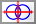</td><td><code>xx-conlang-lojban</code></td><td>Lojban</td></tr>
<tr><td></td><td><code>xx-conlang-novial</code></td><td>Novial</td></tr>
<tr><td></td><td><code>xx-conlang-pandunia</code></td><td>Pandunia</td></tr>
<tr><td></td><td><code>xx-conlang-tokipona</code></td><td>Toki Pona</td></tr>
<tr><td></td><td><code>xx-conlang-volapuk</code></td><td>Volapük</td></tr>
<tr><td></td><td><code>xx-conlang-votgil</code></td><td>Vötgil</td></tr>
</table>

## Pride Flags

<table align="center">
<tr><td></td><td><code>xx-pride-abrosexual</code></td><td>Abrosexual Pride</td></tr>
<tr><td></td><td><code>xx-pride-aceflux</code></td><td>Aceflux Pride</td></tr>
<tr><td></td><td><code>xx-pride-achillean</code></td><td>Achillean Pride</td></tr>
<tr><td></td><td><code>xx-pride-aegosexual</code></td><td>Aegosexual Pride</td></tr>
<tr><td></td><td><code>xx-pride-agender</code></td><td>Agender Pride</td></tr>
<tr><td></td><td><code>xx-pride-ally</code></td><td>Ally Pride</td></tr>
<tr><td></td><td><code>xx-pride-androgyne</code></td><td>Androgyne Pride</td></tr>
<tr><td></td><td><code>xx-pride-androsexual</code></td><td>Androsexual Pride</td></tr>
<tr><td>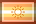</td><td><code>xx-pride-apollonian</code></td><td>Apollonian Pride</td></tr>
<tr><td></td><td><code>xx-pride-aporagender</code></td><td>Aporagender Pride</td></tr>
<tr><td></td><td><code>xx-pride-aroace</code></td><td>Aro/Ace Pride</td></tr>
<tr><td></td><td><code>xx-pride-aroflux</code></td><td>Aroflux Pride</td></tr>
<tr><td></td><td><code>xx-pride-aromantic</code></td><td>Aromantic Pride</td></tr>
<tr><td></td><td><code>xx-pride-asexual</code></td><td>Asexual Pride</td></tr>
<tr><td></td><td><code>xx-pride-aspectrum</code></td><td>A-Spectrum Pride</td></tr>
<tr><td></td><td><code>xx-pride-bdsm</code></td><td>BDSM Pride</td></tr>
<tr><td></td><td><code>xx-pride-bear</code></td><td>Bear Pride</td></tr>
<tr><td></td><td><code>xx-pride-bigender-1</code></td><td>Bigender Pride</td></tr>
<tr><td></td><td><code>xx-pride-bigender-2</code></td><td>Bigender Pride</td></tr>
<tr><td></td><td><code>xx-pride-bigender-3</code></td><td>Bigender Pride</td></tr>
<tr><td></td><td><code>xx-pride-bisexual</code></td><td>Bisexual Pride</td></tr>
<tr><td></td><td><code>xx-pride-ceterosexual</code></td><td>Ceterosexual Pride</td></tr>
<tr><td></td><td><code>xx-pride-demiandrogyne-1</code></td><td>Demiandrogyne Pride</td></tr>
<tr><td></td><td><code>xx-pride-demiandrogyne-2</code></td><td>Demiandrogyne Pride</td></tr>
<tr><td></td><td><code>xx-pride-demiboy</code></td><td>Demiboy Pride</td></tr>
<tr><td></td><td><code>xx-pride-demifluid</code></td><td>Demifluid Pride</td></tr>
<tr><td></td><td><code>xx-pride-demiflux</code></td><td>Demiflux Pride</td></tr>
<tr><td></td><td><code>xx-pride-demigender</code></td><td>Demigender Pride</td></tr>
<tr><td></td><td><code>xx-pride-demigirl</code></td><td>Demigirl Pride</td></tr>
<tr><td></td><td><code>xx-pride-demiromantic</code></td><td>Demiromantic Pride</td></tr>
<tr><td></td><td><code>xx-pride-demisexual</code></td><td>Demisexual Pride</td></tr>
<tr><td></td><td><code>xx-pride-diamoric</code></td><td>Diamoric Pride</td></tr>
<tr><td></td><td><code>xx-pride-dollgender</code></td><td>Dollgender Pride</td></tr>
<tr><td></td><td><code>xx-pride-fat-fetish</code></td><td>Fat Fetish Flag</td></tr>
<tr><td></td><td><code>xx-pride-gay-male-1</code></td><td>Gay Male Pride</td></tr>
<tr><td></td><td><code>xx-pride-gay-male-2</code></td><td>Gay Male Pride</td></tr>
<tr><td></td><td><code>xx-pride-gay-male-3</code></td><td>Gay Male Pride</td></tr>
<tr><td></td><td><code>xx-pride-gay-male-4</code></td><td>Gay Male Pride</td></tr>
<tr><td></td><td><code>xx-pride-gender-neutral</code></td><td>Gender Neutral Pride</td></tr>
<tr><td></td><td><code>xx-pride-genderfluid</code></td><td>Genderfluid Pride</td></tr>
<tr><td></td><td><code>xx-pride-genderflux</code></td><td>Genderflux Pride</td></tr>
<tr><td></td><td><code>xx-pride-genderqueer</code></td><td>Genderqueer Pride</td></tr>
<tr><td></td><td><code>xx-pride-greygender</code></td><td>Greygender Pride</td></tr>
<tr><td></td><td><code>xx-pride-greysexual</code></td><td>Greysexual Pride</td></tr>
<tr><td></td><td><code>xx-pride-gynesexual</code></td><td>Gynesexual Pride</td></tr>
<tr><td></td><td><code>xx-pride-heterosexual</code></td><td>Heterosexual Pride</td></tr>
<tr><td></td><td><code>xx-pride-intersex-1</code></td><td>Intersex Pride</td></tr>
<tr><td></td><td><code>xx-pride-intersex-2</code></td><td>Intersex Pride</td></tr>
<tr><td></td><td><code>xx-pride-leather</code></td><td>Leather Pride</td></tr>
<tr><td></td><td><code>xx-pride-lesbian-1</code></td><td>Lesbian Pride (deprecated)</td></tr>
<tr><td></td><td><code>xx-pride-lesbian-2</code></td><td>Lesbian Pride (deprecated)</td></tr>
<tr><td></td><td><code>xx-pride-lesbian-3</code></td><td>Lesbian Pride (deprecated)</td></tr>
<tr><td></td><td><code>xx-pride-lesbian-4</code></td><td>Lesbian Pride (deprecated)</td></tr>
<tr><td></td><td><code>xx-pride-lesbian-5</code></td><td>Lesbian Pride (inclusive, original)</td></tr>
<tr><td></td><td><code>xx-pride-lesbian-6</code></td><td>Lesbian Pride (inclusive, revised)</td></tr>
<tr><td></td><td><code>xx-pride-lgbt</code></td><td>LGBT Pride</td></tr>
<tr><td></td><td><code>xx-pride-lgbt-crab</code></td><td>LGBT Pride (Cool Crab)</td></tr>
<tr><td></td><td><code>xx-pride-lgbt-7band</code></td><td>LGBT Pride (7-Band Version)</td></tr>
<tr><td></td><td><code>xx-pride-lgbt-8band</code></td><td>LGBT Pride (8-Band Version)</td></tr>
<tr><td></td><td><code>xx-pride-lgbt-9band</code></td><td>LGBT Pride (9-Band Version)</td></tr>
<tr><td></td><td><code>xx-pride-lgbt-br</code></td><td>LGBT Pride (Brazil)</td></tr>
<tr><td></td><td><code>xx-pride-lgbt-ca</code></td><td>LGBT Pride (Canada)</td></tr>
<tr><td></td><td><code>xx-pride-lgbt-hk</code></td><td>LGBT Pride (Hong Kong)</td></tr>
<tr><td></td><td><code>xx-pride-lgbt-il</code></td><td>LGBT Pride (Israel)</td></tr>
<tr><td></td><td><code>xx-pride-lgbt-tw</code></td><td>LGBT Pride (Taiwan)</td></tr>
<tr><td></td><td><code>xx-pride-lgbt-gb</code></td><td>LGBT Pride (UK)</td></tr>
<tr><td></td><td><code>xx-pride-lgbt-uk</code></td><td>LGBT Pride (UK)</td></tr>
<tr><td></td><td><code>xx-pride-lgbt-us</code></td><td>LGBT Pride (United States)</td></tr>
<tr><td></td><td><code>xx-pride-lgbt-us-co</code></td><td>LGBT Pride (Colorado)</td></tr>
<tr><td></td><td><code>xx-pride-lgbt-us-phl</code></td><td>LGBT Pride (Philadelphia)</td></tr>
<tr><td></td><td><code>xx-pride-lgbt-za</code></td><td>LGBT Pride (South Africa)</td></tr>
<tr><td></td><td><code>xx-pride-lgbt-progress</code></td><td>Daniel Quasar's Progress Pride Flag</td></tr>
<tr><td></td><td><code>xx-pride-lgbt-progress-2021</code></td><td>Valentino Vecchietti's Progress Pride Flag</td></tr>
<tr><td></td><td><code>xx-pride-lipstick-1</code></td><td>Lipstick Lesbian Pride (deprecated)</td></tr>
<tr><td></td><td><code>xx-pride-lipstick-2</code></td><td>Lipstick Lesbian Pride (inclusive)</td></tr>
<tr><td></td><td><code>xx-pride-littleender</code></td><td>Littleender Pride</td></tr>
<tr><td></td><td><code>xx-pride-master-slave</code></td><td>Master-Slave Pride</td></tr>
<tr><td></td><td><code>xx-pride-maverique</code></td><td>Maverique Pride</td></tr>
<tr><td></td><td><code>xx-pride-multigender</code></td><td>Multigender Pride</td></tr>
<tr><td></td><td><code>xx-pride-multisexual</code></td><td>Multisexual Pride</td></tr>
<tr><td></td><td><code>xx-pride-neptunic</code></td><td>Neptunic Pride</td></tr>
<tr><td></td><td><code>xx-pride-neutrois</code></td><td>Neutrois Pride</td></tr>
<tr><td></td><td><code>xx-pride-nonbinary</code></td><td>Non-Binary Pride</td></tr>
<tr><td></td><td><code>xx-pride-omnisexual</code></td><td>Omnisexual Pride</td></tr>
<tr><td></td><td><code>xx-pride-ownership</code></td><td>Ownership Flag</td></tr>
<tr><td></td><td><code>xx-pride-pangender</code></td><td>Pangender Pride</td></tr>
<tr><td></td><td><code>xx-pride-pansexual</code></td><td>Pansexual Pride</td></tr>
<tr><td></td><td><code>xx-pride-poly-1</code></td><td>Poly Pride</td></tr>
<tr><td></td><td><code>xx-pride-poly-2</code></td><td>Poly Pride</td></tr>
<tr><td></td><td><code>xx-pride-poly-3</code></td><td>Poly Pride</td></tr>
<tr><td></td><td><code>xx-pride-polygender</code></td><td>Polygender Pride</td></tr>
<tr><td></td><td><code>xx-pride-polysexual</code></td><td>Polysexual Pride</td></tr>
<tr><td></td><td><code>xx-pride-pomosexual</code></td><td>Pomosexual Pride</td></tr>
<tr><td></td><td><code>xx-pride-proculsexual</code></td><td>Proculsexual Pride</td></tr>
<tr><td></td><td><code>xx-pride-queer</code></td><td>Queer Pride</td></tr>
<tr><td></td><td><code>xx-pride-rubber</code></td><td>Rubber Pride</td></tr>
<tr><td></td><td><code>xx-pride-sapphic</code></td><td>Sapphic Pride</td></tr>
<tr><td></td><td><code>xx-pride-trans</code></td><td>Trans Pride</td></tr>
<tr><td></td><td><code>xx-pride-trans-crab</code></td><td>Trans Pride (Cool Crab)</td></tr>
<tr><td></td><td><code>xx-pride-trans-il</code></td><td>Trans Pride (Israel)</td></tr>
<tr><td></td><td><code>xx-pride-transfeminine</code></td><td>Transfeminine Pride</td></tr>
<tr><td></td><td><code>xx-pride-transmasculine</code></td><td>Transmasculine Pride</td></tr>
<tr><td></td><td><code>xx-pride-transneutral</code></td><td>Transneutral Pride</td></tr>
<tr><td></td><td><code>xx-pride-trigender</code></td><td>Trigender Pride</td></tr>
<tr><td></td><td><code>xx-pride-twink</code></td><td>Twink Pride</td></tr>
<tr><td></td><td><code>xx-pride-unlabeled</code></td><td>Unlabeled Pride</td></tr>
<tr><td></td><td><code>xx-pride-uranic</code></td><td>Uranic Pride</td></tr>
<tr><td></td><td><code>xx-pride-xenogender</code></td><td>Xenogender Pride</td></tr>
</table>

## Racing Flags

<table align="center">
<tr><td></td><td><code>xx-racing-start</code></td><td>Start of Race / Safe Conditions / Pit Lane Open</td></tr>
<tr><td></td><td><code>xx-racing-caution</code></td><td>Caution</td></tr>
<tr><td></td><td><code>xx-racing-hazard</code></td><td>Debris/Fluid/Oil on Track</td></tr>
<tr><td></td><td><code>xx-racing-pit-closed</code></td><td>Pit Lane Closed</td></tr>
<tr><td></td><td><code>xx-racing-stop</code></td><td>Race Stopped or Delayed</td></tr>
<tr><td></td><td><code>xx-racing-code-60</code></td><td>Code 60</td></tr>
<tr><td></td><td><code>xx-racing-slow-vehicle</code></td><td>Slow Vehicle on Track / Final Lap</td></tr>
<tr><td></td><td><code>xx-racing-final-lap</code></td><td>Final Lap / Ambulance on Course</td></tr>
<tr><td></td><td><code>xx-racing-return</code></td><td>Return to Pits for Penalty or Disqualification</td></tr>
<tr><td></td><td><code>xx-racing-return-service</code></td><td>Return to Pits to Service a Mechanical Problem</td></tr>
<tr><td></td><td><code>xx-racing-unsportsmanlike</code></td><td>Unsportsmanlike Conduct</td></tr>
<tr><td></td><td><code>xx-racing-not-scored</code></td><td>Ignoring Black Flag; No Longer Being Scored</td></tr>
<tr><td></td><td><code>xx-racing-faster-car-1</code></td><td>Faster Car Approaching (FIA)</td></tr>
<tr><td></td><td><code>xx-racing-faster-car-2</code></td><td>Faster Car Approaching (NASCAR/Indy)</td></tr>
<tr><td></td><td><code>xx-racing-finish-stage</code></td><td>Racing Stage Finished (Green Checkered Flag)</td></tr>
<tr><td></td><td><code>xx-racing-finish</code></td><td>Race Finished (Checkered Flag)</td></tr>
<tr><td></td><td><code>xx-racing-ambulance</code></td><td>Medical Attention Required / Ambulance on Course</td></tr>
<tr><td></td><td><code>xx-racing-precipitation</code></td><td>Precipitation</td></tr>
<tr><td></td><td><code>xx-racing-leave-course</code></td><td>Rider Must Leave Course</td></tr>
<tr><td></td><td><code>xx-racing-faster-motorcycle</code></td><td>Faster Motorcycle Approaching</td></tr>
<tr><td></td><td><code>xx-racing-visibility</code></td><td>Poor Visibility Ahead</td></tr>
<tr><td></td><td><code>xx-racing-sun</code></td><td>Glare from Sun Ahead</td></tr>
</table>

## Miscellaneous Flags

<table align="center">
<tr><td></td><td><code>xx-aristasia</code></td><td>Aristasia</td></tr>
<tr><td></td><td><code>xx-blm</code></td><td>Black Lives Matter</td></tr>
<tr><td></td><td><code>xx-christian</code></td><td>Christian</td></tr>
<tr><td></td><td><code>xx-genovia</code></td><td>Genovia</td></tr>
<tr><td></td><td><code>xx-misc-cmc</code></td><td>Cutie Mark Day Camp</td></tr>
<tr><td></td><td><code>xx-misc-cmyk</code></td><td>CMYK</td></tr>
<tr><td></td><td><code>xx-misc-fam</code></td><td>FamFamFam</td></tr>
<tr><td></td><td><code>xx-misc-gus-cheer</code></td><td>Gus’ Cheer Flag</td></tr>
<tr><td></td><td><code>xx-misc-hello-internet</code></td><td>Hello Internet</td></tr>
<tr><td></td><td><code>xx-misc-iguana</code></td><td>Iguana iguana powersurgius</td></tr>
<tr><td></td><td><code>xx-misc-lunanova</code></td><td>Luna Nova</td></tr>
<tr><td></td><td><code>xx-misc-ntsc</code></td><td>NTSC Color Bars</td></tr>
<tr><td></td><td><code>xx-misc-ntscid</code></td><td>NTSC Color Bars (with Station ID)</td></tr>
<tr><td></td><td><code>xx-misc-r-vexillology</code></td><td>r/vexillology</td></tr>
<tr><td></td><td><code>xx-misc-rgb</code></td><td>RGB</td></tr>
<tr><td></td><td><code>xx-misc-vexillo</code></td><td>Vexillo</td></tr>
<tr><td></td><td><code>xx-northtakoma</code></td><td>North Takoma</td></tr>
<tr><td></td><td><code>xx-org-fiav</code></td><td>International Federation of Vexillological Associations</td></tr>
<tr><td></td><td><code>xx-org-fotw</code></td><td>Flags of the World</td></tr>
<tr><td></td><td><code>xx-org-nava</code></td><td>North American Vexillological Association</td></tr>
<tr><td></td><td><code>xx-org-pfa</code></td><td>Portland Flag Association</td></tr>
<tr><td></td><td><code>xx-otherkin</code></td><td>Otherkin</td></tr>
<tr><td></td><td><code>xx-oz</code></td><td>Oz</td></tr>
<tr><td></td><td><code>xx-pace</code></td><td>Pace</td></tr>
<tr><td></td><td><code>xx-pirate</code></td><td>Pirate</td></tr>
<tr><td></td><td><code>xx-trains</code></td><td>Train Landscape (Ellsworth Kelly, 1953)</td></tr>
<tr><td></td><td><code>xx-wakanda</code></td><td>Wakanda</td></tr>
</table>

## Kreative Media

<table align="center">
<tr><td></td><td><code>xx-kk-kappaa</code></td><td>Kappaa</td></tr>
<tr><td>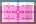</td><td><code>xx-kk-kellahanamana</code></td><td>Kellahanamana</td></tr>
<tr><td></td><td><code>xx-kk-mika</code></td><td>Mika</td></tr>
<tr><td></td><td><code>xx-kk-mika-annett</code></td><td>Annett-Toynenda</td></tr>
<tr><td></td><td><code>xx-kk-mika-harrett</code></td><td>Harrett</td></tr>
<tr><td></td><td><code>xx-kk-mika-korra</code></td><td>Korra-Texxa</td></tr>
<tr><td></td><td><code>xx-kk-mika-lyndaea</code></td><td>Lyndaea</td></tr>
<tr><td></td><td><code>xx-kk-mika-morra</code></td><td>Morra-Rytta</td></tr>
<tr><td></td><td><code>xx-kk-mika-olla</code></td><td>Ölla-Senna</td></tr>
<tr><td></td><td><code>xx-kk-mika-tammy</code></td><td>Tammy</td></tr>
<tr><td></td><td><code>xx-kk-mika-emily</code></td><td>Emily</td></tr>
</table>

----

# Roadmap to the GitHub Repository

## [`artwork/vexillo`](artwork/vexillo)

This directory contains generated flag images in both SVG and PNG formats in a variety of sizes and aspect ratios. Each series is in its own subdirectory, named according to the following scheme:

  * The first letter indicates the format:
    * `s` indicates SVG files.
    * `p` indicates PNG files.
  * The second letter indicates the finish:
    * `m` indicates a plain matte finish.
    * `g` indicates a glossy finish, like on FamFamFam flag icons.
    * `v` indicates a style matching that of another vendor.
  * For a second letter of `m` or `g`, the third letter indicates the aspect ratio:
    * `a` indicates an aspect ratio that matches the official proper dimensions of each flag.
    * `b` indicates a 5:3 aspect ratio.
    * `c` indicates a 3:2 aspect ratio.
    * `d` indicates a 4:3 or “fullscreen” aspect ratio.
    * `e` indicates a 5:4 aspect ratio.
    * `f` indicates a 1:1 or square aspect ratio.
    * `h` indicates a 2:1 aspect ratio.
    * `k` indicates a 16:11 aspect ratio, which matches FamFamFam flag icons.
    * `v` indicates a 16:10 or “fullscreen/widescreen compromise” aspect ratio.
    * `w` indicates a 16:9 or “widescreen” aspect ratio.
  * For a second letter of `v`, the third letter indicates the vendor whose style is being emulated:
    * `f` for the vendor with a fruit-based name.
    * `n` for the vendor with a number-based name.
    * `b` for the vendor with a bird-based name.
  * For a second letter of `m` or `g`, the last three digits indicate the size of the image:
    * `024` indicates a **height** of 24px (or 22px for the `k` series). This size is ideal for icons.
    * `072` indicates a **height** of 72px (or 66px for the `k` series).
    * `128` indicates a **width** of 128px (for all series including `k`). This size is intended for emoji fonts.
    * `360` indicates a **height** of 360px (or 396px for the `k` series).
  * For a second letter of `v`, the last three digits simply reflect the height of the image.

## [`fonts/Vexillo`](fonts/Vexillo)

This directory contains generated emoji fonts using flag images. Each font file is named according to the following scheme:

  * Every font file name starts with `Vexillo`.
  * The first following letter indicates the finish:
    * `M` indicates a plain matte finish.
    * `G` indicates a glossy finish, like on FamFamFam flag icons.
    * `V` indicates a style matching that of another vendor.
  * For a first following letter of `M` or `G`, the second following letter indicates the aspect ratio:
    * `A` indicates an aspect ratio that matches the official proper dimensions of each flag.
    * `B` indicates a 5:3 aspect ratio.
    * `C` indicates a 3:2 aspect ratio.
    * `D` indicates a 4:3 or “fullscreen” aspect ratio.
    * `E` indicates a 5:4 aspect ratio.
    * `F` indicates a 1:1 or square aspect ratio.
    * `H` indicates a 2:1 aspect ratio.
    * `K` indicates a 16:11 aspect ratio, which matches FamFamFam flag icons.
    * `V` indicates a 16:10 or “fullscreen/widescreen compromise” aspect ratio.
    * `W` indicates a 16:9 or “widescreen” aspect ratio.
  * For a first following letter of `V`, the second following letter indicates the vendor whose style is being emulated:
    * `F` for the vendor whose name rhymes with 'grapple'.
    * `N` for the vendor whose name rhymes with 'frugal'.
    * `B` for the vendor whose name rhymes with 'jitter'.
  * The file extension indicates the platform supported:
    * `.ttf.sbix.ttf` files work on Mac OS 10.8 Mountain Lion and later only.
    * `.ttf.svg.ttf` files work in Mozilla Firefox and will soon work in Adobe applications and on Windows 10.

## [`downloads`](downloads)

Each series of flag icons is available here as a ZIP archive. The names of the ZIP archives follow the scheme described above. Also available are the emoji fonts in a single ZIP archive, the `.kvxx` files in a ZIP archive, and the Vexillo command line tool JAR.

## [`main/java/Vexillo`](main/java/Vexillo)

The Java project for the Vexillo command line tools. Run `make` to compile the JAR and `make install` to install the tools in `/usr/local/bin/`. The command line tools include:

  * `vexillo view` or `vexview` - View `.kvxx` files in a window.
  * `vexillo export` or `vexport` - Convert `.kvxx` files to SVG or PNG in any size.
  * `vexillo emoji` or `vexmoji` - Convert `.kvxx` files to SFD, PNG, and SVG files used to compile an emoji font.
  * `vexillo info` or `vexinfo` - Print information about `.kvxx` files.
  * `vexillo calc` or `vexcalc` - Calculator.
  * `base64encode` and `base64decode` - Convert files to and from Base64 (used in `.kvxx` and SVG files).
  * `ascii85encode` and `ascii85decode` - Convert files to and from ASCII85 (used in `.kvxx` and PostScript files).

Any of these commands can be run with `--help` for information on their parameters.

## [`flags`](flags)

The `.kvxx` files containing descriptions of flags.

Run the `makeflags` script to generate SVG and PNG files from the `.kvxx` files. The resulting output directory will contain the generated images in the directory structure described above.

Run the `makefonts` script to generate emoji fonts from the `.kvxx` files. The `makefonts` script depends on FontForge and [Kreative Bits'n'Picas](https://github.com/kreativekorp/bitsnpicas).

## [`fonts/Fiavex`](fonts/Fiavex)

A TrueType font consisting of vexillological usage and property symbols. The included PDF lists the symbols and PUA code points at which they are encoded.

## [`artwork/myfile`](artwork/myfile)

The [My'file flag icon set](http://www.kreativekorp.com/lib/flags/) of 300 flags in 16px-by-11px PNG format.

## [`artwork/famfamfam`](artwork/famfamfam)

The original [FamFamFam flag icon set](http://www.famfamfam.com/lab/icons/flags/) of 247 flags in 16px-by-11px GIF and PNG formats.

----

# ISO Country Code Subdivision Coverage

Codes without any subdivisions are not listed here.

<table align="center"><tr><td valign="top"><table align="center">
<tr><td>&nbsp;&nbsp;<a href="https://en.wikipedia.org/wiki/ISO_3166-2:AD"><code>ad</code></a></td><td>&nbsp; 0/7</td></tr>
<tr><td>&nbsp;&nbsp;<a href="https://en.wikipedia.org/wiki/ISO_3166-2:AE"><code>ae</code></a></td><td>&nbsp; 0/7</td></tr>
<tr><td>&nbsp;&nbsp;<a href="https://en.wikipedia.org/wiki/ISO_3166-2:AF"><code>af</code></a></td><td>&nbsp; 0/34</td></tr>
<tr><td>&nbsp;&nbsp;<a href="https://en.wikipedia.org/wiki/ISO_3166-2:AG"><code>ag</code></a></td><td>&nbsp; 0/8</td></tr>
<tr><td>&nbsp;&nbsp;<a href="https://en.wikipedia.org/wiki/ISO_3166-2:AL"><code>al</code></a></td><td>&nbsp; 0/12</td></tr>
<tr><td>&nbsp;&nbsp;<a href="https://en.wikipedia.org/wiki/ISO_3166-2:AM"><code>am</code></a></td><td>&nbsp; 0/11</td></tr>
<tr><td>&nbsp;&nbsp;<a href="https://en.wikipedia.org/wiki/ISO_3166-2:AO"><code>ao</code></a></td><td>&nbsp; 0/18</td></tr>
<tr><td>&nbsp;&nbsp;<a href="https://en.wikipedia.org/wiki/ISO_3166-2:AR"><code>ar</code></a></td><td>&nbsp; 0/24</td></tr>
<tr><td>&nbsp;&nbsp;<a href="https://en.wikipedia.org/wiki/ISO_3166-2:AT"><code>at</code></a></td><td>&nbsp; 9/9</td></tr>
<tr><td>&nbsp;&nbsp;<a href="https://en.wikipedia.org/wiki/ISO_3166-2:AU"><code>au</code></a></td><td>&nbsp; 0/8</td></tr>
<tr><td>&nbsp;&nbsp;<a href="https://en.wikipedia.org/wiki/ISO_3166-2:AZ"><code>az</code></a></td><td>&nbsp; 0/78</td></tr>
<tr><td>&nbsp;&nbsp;<a href="https://en.wikipedia.org/wiki/ISO_3166-2:BA"><code>ba</code></a></td><td>&nbsp; 0/3</td></tr>
<tr><td>&nbsp;&nbsp;<a href="https://en.wikipedia.org/wiki/ISO_3166-2:BB"><code>bb</code></a></td><td>&nbsp; 0/11</td></tr>
<tr><td>&nbsp;&nbsp;<a href="https://en.wikipedia.org/wiki/ISO_3166-2:BD"><code>bd</code></a></td><td>&nbsp; 0/72</td></tr>
<tr><td>&nbsp;&nbsp;<a href="https://en.wikipedia.org/wiki/ISO_3166-2:BE"><code>be</code></a></td><td>&nbsp; 0/13</td></tr>
<tr><td>&nbsp;&nbsp;<a href="https://en.wikipedia.org/wiki/ISO_3166-2:BF"><code>bf</code></a></td><td>&nbsp; 0/58</td></tr>
<tr><td>&nbsp;&nbsp;<a href="https://en.wikipedia.org/wiki/ISO_3166-2:BG"><code>bg</code></a></td><td>&nbsp; 0/28</td></tr>
<tr><td>&nbsp;&nbsp;<a href="https://en.wikipedia.org/wiki/ISO_3166-2:BH"><code>bh</code></a></td><td>&nbsp; 0/4</td></tr>
<tr><td>&nbsp;&nbsp;<a href="https://en.wikipedia.org/wiki/ISO_3166-2:BI"><code>bi</code></a></td><td>&nbsp; 0/18</td></tr>
<tr><td>&nbsp;&nbsp;<a href="https://en.wikipedia.org/wiki/ISO_3166-2:BJ"><code>bj</code></a></td><td>&nbsp; 0/12</td></tr>
<tr><td>&nbsp;&nbsp;<a href="https://en.wikipedia.org/wiki/ISO_3166-2:BN"><code>bn</code></a></td><td>&nbsp; 0/4</td></tr>
<tr><td>&nbsp;&nbsp;<a href="https://en.wikipedia.org/wiki/ISO_3166-2:BO"><code>bo</code></a></td><td>&nbsp; 0/9</td></tr>
<tr><td>&nbsp;&nbsp;<a href="https://en.wikipedia.org/wiki/ISO_3166-2:BQ"><code>bq</code></a></td><td>&nbsp; 3/3</td></tr>
<tr><td>&nbsp;&nbsp;<a href="https://en.wikipedia.org/wiki/ISO_3166-2:BR"><code>br</code></a></td><td>&nbsp; 0/27</td></tr>
<tr><td>&nbsp;&nbsp;<a href="https://en.wikipedia.org/wiki/ISO_3166-2:BS"><code>bs</code></a></td><td>&nbsp; 0/32</td></tr>
<tr><td>&nbsp;&nbsp;<a href="https://en.wikipedia.org/wiki/ISO_3166-2:BT"><code>bt</code></a></td><td>&nbsp; 0/20</td></tr>
<tr><td>&nbsp;&nbsp;<a href="https://en.wikipedia.org/wiki/ISO_3166-2:BW"><code>bw</code></a></td><td>&nbsp; 0/16</td></tr>
<tr><td>&nbsp;&nbsp;<a href="https://en.wikipedia.org/wiki/ISO_3166-2:BY"><code>by</code></a></td><td>&nbsp; 0/7</td></tr>
<tr><td>&nbsp;&nbsp;<a href="https://en.wikipedia.org/wiki/ISO_3166-2:BZ"><code>bz</code></a></td><td>&nbsp; 0/6</td></tr>
<tr><td>&nbsp;&nbsp;<a href="https://en.wikipedia.org/wiki/ISO_3166-2:CA"><code>ca</code></a></td><td>&nbsp; 13/13</td></tr>
<tr><td>&nbsp;&nbsp;<a href="https://en.wikipedia.org/wiki/ISO_3166-2:CD"><code>cd</code></a></td><td>&nbsp; 0/26</td></tr>
<tr><td>&nbsp;&nbsp;<a href="https://en.wikipedia.org/wiki/ISO_3166-2:CF"><code>cf</code></a></td><td>&nbsp; 0/17</td></tr>
<tr><td>&nbsp;&nbsp;<a href="https://en.wikipedia.org/wiki/ISO_3166-2:CG"><code>cg</code></a></td><td>&nbsp; 0/12</td></tr>
<tr><td>&nbsp;&nbsp;<a href="https://en.wikipedia.org/wiki/ISO_3166-2:CH"><code>ch</code></a></td><td>&nbsp; 26/26</td></tr>
<tr><td>&nbsp;&nbsp;<a href="https://en.wikipedia.org/wiki/ISO_3166-2:CI"><code>ci</code></a></td><td>&nbsp; 0/14</td></tr>
<tr><td>&nbsp;&nbsp;<a href="https://en.wikipedia.org/wiki/ISO_3166-2:CL"><code>cl</code></a></td><td>&nbsp; 0/16</td></tr>
<tr><td>&nbsp;&nbsp;<a href="https://en.wikipedia.org/wiki/ISO_3166-2:CM"><code>cm</code></a></td><td>&nbsp; 0/10</td></tr>
<tr><td>&nbsp;&nbsp;<a href="https://en.wikipedia.org/wiki/ISO_3166-2:CN"><code>cn</code></a></td><td>&nbsp; 0/34</td></tr>
<tr><td>&nbsp;&nbsp;<a href="https://en.wikipedia.org/wiki/ISO_3166-2:CO"><code>co</code></a></td><td>&nbsp; 0/33</td></tr>
<tr><td>&nbsp;&nbsp;<a href="https://en.wikipedia.org/wiki/ISO_3166-2:CR"><code>cr</code></a></td><td>&nbsp; 0/7</td></tr>
<tr><td>&nbsp;&nbsp;<a href="https://en.wikipedia.org/wiki/ISO_3166-2:CS"><code>cs</code></a></td><td>&nbsp; 0/4</td></tr>
<tr><td>&nbsp;&nbsp;<a href="https://en.wikipedia.org/wiki/ISO_3166-2:CU"><code>cu</code></a></td><td>&nbsp; 0/16</td></tr>
<tr><td>&nbsp;&nbsp;<a href="https://en.wikipedia.org/wiki/ISO_3166-2:CV"><code>cv</code></a></td><td>&nbsp; 0/24</td></tr>
<tr><td>&nbsp;&nbsp;<a href="https://en.wikipedia.org/wiki/ISO_3166-2:CY"><code>cy</code></a></td><td>&nbsp; 0/6</td></tr>
<tr><td>&nbsp;&nbsp;<a href="https://en.wikipedia.org/wiki/ISO_3166-2:CZ"><code>cz</code></a></td><td>&nbsp; 0/90</td></tr>
<tr><td>&nbsp;&nbsp;<a href="https://en.wikipedia.org/wiki/ISO_3166-2:DE"><code>de</code></a></td><td>&nbsp; 16/16</td></tr>
<tr><td>&nbsp;&nbsp;<a href="https://en.wikipedia.org/wiki/ISO_3166-2:DJ"><code>dj</code></a></td><td>&nbsp; 0/6</td></tr>
<tr><td>&nbsp;&nbsp;<a href="https://en.wikipedia.org/wiki/ISO_3166-2:DK"><code>dk</code></a></td><td>&nbsp; 0/5</td></tr>
<tr><td>&nbsp;&nbsp;<a href="https://en.wikipedia.org/wiki/ISO_3166-2:DM"><code>dm</code></a></td><td>&nbsp; 0/10</td></tr>
<tr><td>&nbsp;&nbsp;<a href="https://en.wikipedia.org/wiki/ISO_3166-2:DO"><code>do</code></a></td><td>&nbsp; 0/42</td></tr>
<tr><td>&nbsp;&nbsp;<a href="https://en.wikipedia.org/wiki/ISO_3166-2:DZ"><code>dz</code></a></td><td>&nbsp; 0/58</td></tr>
</table></td><td valign="top"><table align="center">
<tr><td>&nbsp;&nbsp;<a href="https://en.wikipedia.org/wiki/ISO_3166-2:EC"><code>ec</code></a></td><td>&nbsp; 0/24</td></tr>
<tr><td>&nbsp;&nbsp;<a href="https://en.wikipedia.org/wiki/ISO_3166-2:EE"><code>ee</code></a></td><td>&nbsp; 0/94</td></tr>
<tr><td>&nbsp;&nbsp;<a href="https://en.wikipedia.org/wiki/ISO_3166-2:EG"><code>eg</code></a></td><td>&nbsp; 0/27</td></tr>
<tr><td>&nbsp;&nbsp;<a href="https://en.wikipedia.org/wiki/ISO_3166-2:ER"><code>er</code></a></td><td>&nbsp; 0/6</td></tr>
<tr><td>&nbsp;&nbsp;<a href="https://en.wikipedia.org/wiki/ISO_3166-2:ES"><code>es</code></a></td><td>&nbsp; 4/69</td></tr>
<tr><td>&nbsp;&nbsp;<a href="https://en.wikipedia.org/wiki/ISO_3166-2:ET"><code>et</code></a></td><td>&nbsp; 0/13</td></tr>
<tr><td>&nbsp;&nbsp;<a href="https://en.wikipedia.org/wiki/ISO_3166-2:FI"><code>fi</code></a></td><td>&nbsp; 0/19</td></tr>
<tr><td>&nbsp;&nbsp;<a href="https://en.wikipedia.org/wiki/ISO_3166-2:FJ"><code>fj</code></a></td><td>&nbsp; 0/19</td></tr>
<tr><td>&nbsp;&nbsp;<a href="https://en.wikipedia.org/wiki/ISO_3166-2:FM"><code>fm</code></a></td><td>&nbsp; 4/4</td></tr>
<tr><td>&nbsp;&nbsp;<a href="https://en.wikipedia.org/wiki/ISO_3166-2:FR"><code>fr</code></a></td><td>&nbsp; 3/124</td></tr>
<tr><td>&nbsp;&nbsp;<a href="https://en.wikipedia.org/wiki/ISO_3166-2:GA"><code>ga</code></a></td><td>&nbsp; 0/9</td></tr>
<tr><td>&nbsp;&nbsp;<a href="https://en.wikipedia.org/wiki/ISO_3166-2:GB"><code>gb</code></a></td><td>&nbsp; 6/221</td></tr>
<tr><td>&nbsp;&nbsp;<a href="https://en.wikipedia.org/wiki/ISO_3166-2:GD"><code>gd</code></a></td><td>&nbsp; 0/7</td></tr>
<tr><td>&nbsp;&nbsp;<a href="https://en.wikipedia.org/wiki/ISO_3166-2:GE"><code>ge</code></a></td><td>&nbsp; 0/12</td></tr>
<tr><td>&nbsp;&nbsp;<a href="https://en.wikipedia.org/wiki/ISO_3166-2:GH"><code>gh</code></a></td><td>&nbsp; 0/16</td></tr>
<tr><td>&nbsp;&nbsp;<a href="https://en.wikipedia.org/wiki/ISO_3166-2:GL"><code>gl</code></a></td><td>&nbsp; 0/5</td></tr>
<tr><td>&nbsp;&nbsp;<a href="https://en.wikipedia.org/wiki/ISO_3166-2:GM"><code>gm</code></a></td><td>&nbsp; 0/6</td></tr>
<tr><td>&nbsp;&nbsp;<a href="https://en.wikipedia.org/wiki/ISO_3166-2:GN"><code>gn</code></a></td><td>&nbsp; 0/41</td></tr>
<tr><td>&nbsp;&nbsp;<a href="https://en.wikipedia.org/wiki/ISO_3166-2:GQ"><code>gq</code></a></td><td>&nbsp; 0/10</td></tr>
<tr><td>&nbsp;&nbsp;<a href="https://en.wikipedia.org/wiki/ISO_3166-2:GR"><code>gr</code></a></td><td>&nbsp; 0/14</td></tr>
<tr><td>&nbsp;&nbsp;<a href="https://en.wikipedia.org/wiki/ISO_3166-2:GT"><code>gt</code></a></td><td>&nbsp; 0/22</td></tr>
<tr><td>&nbsp;&nbsp;<a href="https://en.wikipedia.org/wiki/ISO_3166-2:GW"><code>gw</code></a></td><td>&nbsp; 0/12</td></tr>
<tr><td>&nbsp;&nbsp;<a href="https://en.wikipedia.org/wiki/ISO_3166-2:GY"><code>gy</code></a></td><td>&nbsp; 0/10</td></tr>
<tr><td>&nbsp;&nbsp;<a href="https://en.wikipedia.org/wiki/ISO_3166-2:HN"><code>hn</code></a></td><td>&nbsp; 0/18</td></tr>
<tr><td>&nbsp;&nbsp;<a href="https://en.wikipedia.org/wiki/ISO_3166-2:HR"><code>hr</code></a></td><td>&nbsp; 0/21</td></tr>
<tr><td>&nbsp;&nbsp;<a href="https://en.wikipedia.org/wiki/ISO_3166-2:HT"><code>ht</code></a></td><td>&nbsp; 0/10</td></tr>
<tr><td>&nbsp;&nbsp;<a href="https://en.wikipedia.org/wiki/ISO_3166-2:HU"><code>hu</code></a></td><td>&nbsp; 0/43</td></tr>
<tr><td>&nbsp;&nbsp;<a href="https://en.wikipedia.org/wiki/ISO_3166-2:ID"><code>id</code></a></td><td>&nbsp; 0/44</td></tr>
<tr><td>&nbsp;&nbsp;<a href="https://en.wikipedia.org/wiki/ISO_3166-2:IE"><code>ie</code></a></td><td>&nbsp; 0/30</td></tr>
<tr><td>&nbsp;&nbsp;<a href="https://en.wikipedia.org/wiki/ISO_3166-2:IL"><code>il</code></a></td><td>&nbsp; 0/6</td></tr>
<tr><td>&nbsp;&nbsp;<a href="https://en.wikipedia.org/wiki/ISO_3166-2:IN"><code>in</code></a></td><td>&nbsp; 0/36</td></tr>
<tr><td>&nbsp;&nbsp;<a href="https://en.wikipedia.org/wiki/ISO_3166-2:IQ"><code>iq</code></a></td><td>&nbsp; 1/19</td></tr>
<tr><td>&nbsp;&nbsp;<a href="https://en.wikipedia.org/wiki/ISO_3166-2:IR"><code>ir</code></a></td><td>&nbsp; 0/31</td></tr>
<tr><td>&nbsp;&nbsp;<a href="https://en.wikipedia.org/wiki/ISO_3166-2:IS"><code>is</code></a></td><td>&nbsp; 0/72</td></tr>
<tr><td>&nbsp;&nbsp;<a href="https://en.wikipedia.org/wiki/ISO_3166-2:IT"><code>it</code></a></td><td>&nbsp; 1/126</td></tr>
<tr><td>&nbsp;&nbsp;<a href="https://en.wikipedia.org/wiki/ISO_3166-2:JM"><code>jm</code></a></td><td>&nbsp; 0/14</td></tr>
<tr><td>&nbsp;&nbsp;<a href="https://en.wikipedia.org/wiki/ISO_3166-2:JO"><code>jo</code></a></td><td>&nbsp; 0/12</td></tr>
<tr><td>&nbsp;&nbsp;<a href="https://en.wikipedia.org/wiki/ISO_3166-2:JP"><code>jp</code></a></td><td>&nbsp; 47/47</td></tr>
<tr><td>&nbsp;&nbsp;<a href="https://en.wikipedia.org/wiki/ISO_3166-2:KE"><code>ke</code></a></td><td>&nbsp; 0/47</td></tr>
<tr><td>&nbsp;&nbsp;<a href="https://en.wikipedia.org/wiki/ISO_3166-2:KG"><code>kg</code></a></td><td>&nbsp; 0/9</td></tr>
<tr><td>&nbsp;&nbsp;<a href="https://en.wikipedia.org/wiki/ISO_3166-2:KH"><code>kh</code></a></td><td>&nbsp; 0/25</td></tr>
<tr><td>&nbsp;&nbsp;<a href="https://en.wikipedia.org/wiki/ISO_3166-2:KI"><code>ki</code></a></td><td>&nbsp; 0/3</td></tr>
<tr><td>&nbsp;&nbsp;<a href="https://en.wikipedia.org/wiki/ISO_3166-2:KM"><code>km</code></a></td><td>&nbsp; 3/3</td></tr>
<tr><td>&nbsp;&nbsp;<a href="https://en.wikipedia.org/wiki/ISO_3166-2:KN"><code>kn</code></a></td><td>&nbsp; 0/16</td></tr>
<tr><td>&nbsp;&nbsp;<a href="https://en.wikipedia.org/wiki/ISO_3166-2:KP"><code>kp</code></a></td><td>&nbsp; 0/13</td></tr>
<tr><td>&nbsp;&nbsp;<a href="https://en.wikipedia.org/wiki/ISO_3166-2:KR"><code>kr</code></a></td><td>&nbsp; 0/17</td></tr>
<tr><td>&nbsp;&nbsp;<a href="https://en.wikipedia.org/wiki/ISO_3166-2:KW"><code>kw</code></a></td><td>&nbsp; 0/6</td></tr>
<tr><td>&nbsp;&nbsp;<a href="https://en.wikipedia.org/wiki/ISO_3166-2:KZ"><code>kz</code></a></td><td>&nbsp; 0/20</td></tr>
<tr><td>&nbsp;&nbsp;<a href="https://en.wikipedia.org/wiki/ISO_3166-2:LA"><code>la</code></a></td><td>&nbsp; 0/18</td></tr>
<tr><td>&nbsp;&nbsp;<a href="https://en.wikipedia.org/wiki/ISO_3166-2:LB"><code>lb</code></a></td><td>&nbsp; 0/8</td></tr>
<tr><td>&nbsp;&nbsp;<a href="https://en.wikipedia.org/wiki/ISO_3166-2:LC"><code>lc</code></a></td><td>&nbsp; 0/10</td></tr>
</table></td><td valign="top"><table align="center">
<tr><td>&nbsp;&nbsp;<a href="https://en.wikipedia.org/wiki/ISO_3166-2:LI"><code>li</code></a></td><td>&nbsp; 0/11</td></tr>
<tr><td>&nbsp;&nbsp;<a href="https://en.wikipedia.org/wiki/ISO_3166-2:LK"><code>lk</code></a></td><td>&nbsp; 0/34</td></tr>
<tr><td>&nbsp;&nbsp;<a href="https://en.wikipedia.org/wiki/ISO_3166-2:LR"><code>lr</code></a></td><td>&nbsp; 0/15</td></tr>
<tr><td>&nbsp;&nbsp;<a href="https://en.wikipedia.org/wiki/ISO_3166-2:LS"><code>ls</code></a></td><td>&nbsp; 0/10</td></tr>
<tr><td>&nbsp;&nbsp;<a href="https://en.wikipedia.org/wiki/ISO_3166-2:LT"><code>lt</code></a></td><td>&nbsp; 0/70</td></tr>
<tr><td>&nbsp;&nbsp;<a href="https://en.wikipedia.org/wiki/ISO_3166-2:LU"><code>lu</code></a></td><td>&nbsp; 0/12</td></tr>
<tr><td>&nbsp;&nbsp;<a href="https://en.wikipedia.org/wiki/ISO_3166-2:LV"><code>lv</code></a></td><td>&nbsp; 0/43</td></tr>
<tr><td>&nbsp;&nbsp;<a href="https://en.wikipedia.org/wiki/ISO_3166-2:LY"><code>ly</code></a></td><td>&nbsp; 0/22</td></tr>
<tr><td>&nbsp;&nbsp;<a href="https://en.wikipedia.org/wiki/ISO_3166-2:MA"><code>ma</code></a></td><td>&nbsp; 0/87</td></tr>
<tr><td>&nbsp;&nbsp;<a href="https://en.wikipedia.org/wiki/ISO_3166-2:MC"><code>mc</code></a></td><td>&nbsp; 0/17</td></tr>
<tr><td>&nbsp;&nbsp;<a href="https://en.wikipedia.org/wiki/ISO_3166-2:MD"><code>md</code></a></td><td>&nbsp; 0/37</td></tr>
<tr><td>&nbsp;&nbsp;<a href="https://en.wikipedia.org/wiki/ISO_3166-2:ME"><code>me</code></a></td><td>&nbsp; 0/24</td></tr>
<tr><td>&nbsp;&nbsp;<a href="https://en.wikipedia.org/wiki/ISO_3166-2:MG"><code>mg</code></a></td><td>&nbsp; 0/6</td></tr>
<tr><td>&nbsp;&nbsp;<a href="https://en.wikipedia.org/wiki/ISO_3166-2:MH"><code>mh</code></a></td><td>&nbsp; 0/26</td></tr>
<tr><td>&nbsp;&nbsp;<a href="https://en.wikipedia.org/wiki/ISO_3166-2:MK"><code>mk</code></a></td><td>&nbsp; 0/80</td></tr>
<tr><td>&nbsp;&nbsp;<a href="https://en.wikipedia.org/wiki/ISO_3166-2:ML"><code>ml</code></a></td><td>&nbsp; 0/11</td></tr>
<tr><td>&nbsp;&nbsp;<a href="https://en.wikipedia.org/wiki/ISO_3166-2:MM"><code>mm</code></a></td><td>&nbsp; 0/15</td></tr>
<tr><td>&nbsp;&nbsp;<a href="https://en.wikipedia.org/wiki/ISO_3166-2:MN"><code>mn</code></a></td><td>&nbsp; 0/22</td></tr>
<tr><td>&nbsp;&nbsp;<a href="https://en.wikipedia.org/wiki/ISO_3166-2:MR"><code>mr</code></a></td><td>&nbsp; 0/15</td></tr>
<tr><td>&nbsp;&nbsp;<a href="https://en.wikipedia.org/wiki/ISO_3166-2:MT"><code>mt</code></a></td><td>&nbsp; 0/68</td></tr>
<tr><td>&nbsp;&nbsp;<a href="https://en.wikipedia.org/wiki/ISO_3166-2:MU"><code>mu</code></a></td><td>&nbsp; 0/12</td></tr>
<tr><td>&nbsp;&nbsp;<a href="https://en.wikipedia.org/wiki/ISO_3166-2:MV"><code>mv</code></a></td><td>&nbsp; 0/21</td></tr>
<tr><td>&nbsp;&nbsp;<a href="https://en.wikipedia.org/wiki/ISO_3166-2:MW"><code>mw</code></a></td><td>&nbsp; 0/31</td></tr>
<tr><td>&nbsp;&nbsp;<a href="https://en.wikipedia.org/wiki/ISO_3166-2:MX"><code>mx</code></a></td><td>&nbsp; 0/32</td></tr>
<tr><td>&nbsp;&nbsp;<a href="https://en.wikipedia.org/wiki/ISO_3166-2:MY"><code>my</code></a></td><td>&nbsp; 0/16</td></tr>
<tr><td>&nbsp;&nbsp;<a href="https://en.wikipedia.org/wiki/ISO_3166-2:MZ"><code>mz</code></a></td><td>&nbsp; 0/11</td></tr>
<tr><td>&nbsp;&nbsp;<a href="https://en.wikipedia.org/wiki/ISO_3166-2:NA"><code>na</code></a></td><td>&nbsp; 0/14</td></tr>
<tr><td>&nbsp;&nbsp;<a href="https://en.wikipedia.org/wiki/ISO_3166-2:NE"><code>ne</code></a></td><td>&nbsp; 0/8</td></tr>
<tr><td>&nbsp;&nbsp;<a href="https://en.wikipedia.org/wiki/ISO_3166-2:NG"><code>ng</code></a></td><td>&nbsp; 0/37</td></tr>
<tr><td>&nbsp;&nbsp;<a href="https://en.wikipedia.org/wiki/ISO_3166-2:NI"><code>ni</code></a></td><td>&nbsp; 0/17</td></tr>
<tr><td>&nbsp;&nbsp;<a href="https://en.wikipedia.org/wiki/ISO_3166-2:NL"><code>nl</code></a></td><td>&nbsp; 3/18</td></tr>
<tr><td>&nbsp;&nbsp;<a href="https://en.wikipedia.org/wiki/ISO_3166-2:NO"><code>no</code></a></td><td>&nbsp; 0/13</td></tr>
<tr><td>&nbsp;&nbsp;<a href="https://en.wikipedia.org/wiki/ISO_3166-2:NP"><code>np</code></a></td><td>&nbsp; 0/7</td></tr>
<tr><td>&nbsp;&nbsp;<a href="https://en.wikipedia.org/wiki/ISO_3166-2:NR"><code>nr</code></a></td><td>&nbsp; 0/14</td></tr>
<tr><td>&nbsp;&nbsp;<a href="https://en.wikipedia.org/wiki/ISO_3166-2:NZ"><code>nz</code></a></td><td>&nbsp; 0/17</td></tr>
<tr><td>&nbsp;&nbsp;<a href="https://en.wikipedia.org/wiki/ISO_3166-2:OM"><code>om</code></a></td><td>&nbsp; 0/11</td></tr>
<tr><td>&nbsp;&nbsp;<a href="https://en.wikipedia.org/wiki/ISO_3166-2:PA"><code>pa</code></a></td><td>&nbsp; 0/14</td></tr>
<tr><td>&nbsp;&nbsp;<a href="https://en.wikipedia.org/wiki/ISO_3166-2:PE"><code>pe</code></a></td><td>&nbsp; 1/26</td></tr>
<tr><td>&nbsp;&nbsp;<a href="https://en.wikipedia.org/wiki/ISO_3166-2:PG"><code>pg</code></a></td><td>&nbsp; 0/22</td></tr>
<tr><td>&nbsp;&nbsp;<a href="https://en.wikipedia.org/wiki/ISO_3166-2:PH"><code>ph</code></a></td><td>&nbsp; 0/98</td></tr>
<tr><td>&nbsp;&nbsp;<a href="https://en.wikipedia.org/wiki/ISO_3166-2:PK"><code>pk</code></a></td><td>&nbsp; 0/7</td></tr>
<tr><td>&nbsp;&nbsp;<a href="https://en.wikipedia.org/wiki/ISO_3166-2:PL"><code>pl</code></a></td><td>&nbsp; 0/16</td></tr>
<tr><td>&nbsp;&nbsp;<a href="https://en.wikipedia.org/wiki/ISO_3166-2:PS"><code>ps</code></a></td><td>&nbsp; 0/16</td></tr>
<tr><td>&nbsp;&nbsp;<a href="https://en.wikipedia.org/wiki/ISO_3166-2:PT"><code>pt</code></a></td><td>&nbsp; 0/20</td></tr>
<tr><td>&nbsp;&nbsp;<a href="https://en.wikipedia.org/wiki/ISO_3166-2:PW"><code>pw</code></a></td><td>&nbsp; 0/16</td></tr>
<tr><td>&nbsp;&nbsp;<a href="https://en.wikipedia.org/wiki/ISO_3166-2:PY"><code>py</code></a></td><td>&nbsp; 0/18</td></tr>
<tr><td>&nbsp;&nbsp;<a href="https://en.wikipedia.org/wiki/ISO_3166-2:QA"><code>qa</code></a></td><td>&nbsp; 0/8</td></tr>
<tr><td>&nbsp;&nbsp;<a href="https://en.wikipedia.org/wiki/ISO_3166-2:RO"><code>ro</code></a></td><td>&nbsp; 0/42</td></tr>
<tr><td>&nbsp;&nbsp;<a href="https://en.wikipedia.org/wiki/ISO_3166-2:RS"><code>rs</code></a></td><td>&nbsp; 0/32</td></tr>
<tr><td>&nbsp;&nbsp;<a href="https://en.wikipedia.org/wiki/ISO_3166-2:RU"><code>ru</code></a></td><td>&nbsp; 0/83</td></tr>
<tr><td>&nbsp;&nbsp;<a href="https://en.wikipedia.org/wiki/ISO_3166-2:RW"><code>rw</code></a></td><td>&nbsp; 0/5</td></tr>
</table></td><td valign="top"><table align="center">
<tr><td>&nbsp;&nbsp;<a href="https://en.wikipedia.org/wiki/ISO_3166-2:SA"><code>sa</code></a></td><td>&nbsp; 0/13</td></tr>
<tr><td>&nbsp;&nbsp;<a href="https://en.wikipedia.org/wiki/ISO_3166-2:SB"><code>sb</code></a></td><td>&nbsp; 0/10</td></tr>
<tr><td>&nbsp;&nbsp;<a href="https://en.wikipedia.org/wiki/ISO_3166-2:SC"><code>sc</code></a></td><td>&nbsp; 0/27</td></tr>
<tr><td>&nbsp;&nbsp;<a href="https://en.wikipedia.org/wiki/ISO_3166-2:SD"><code>sd</code></a></td><td>&nbsp; 0/18</td></tr>
<tr><td>&nbsp;&nbsp;<a href="https://en.wikipedia.org/wiki/ISO_3166-2:SE"><code>se</code></a></td><td>&nbsp; 1/21</td></tr>
<tr><td>&nbsp;&nbsp;<a href="https://en.wikipedia.org/wiki/ISO_3166-2:SG"><code>sg</code></a></td><td>&nbsp; 0/5</td></tr>
<tr><td>&nbsp;&nbsp;<a href="https://en.wikipedia.org/wiki/ISO_3166-2:SH"><code>sh</code></a></td><td>&nbsp; 0/3</td></tr>
<tr><td>&nbsp;&nbsp;<a href="https://en.wikipedia.org/wiki/ISO_3166-2:SI"><code>si</code></a></td><td>&nbsp; 0/212</td></tr>
<tr><td>&nbsp;&nbsp;<a href="https://en.wikipedia.org/wiki/ISO_3166-2:SK"><code>sk</code></a></td><td>&nbsp; 0/8</td></tr>
<tr><td>&nbsp;&nbsp;<a href="https://en.wikipedia.org/wiki/ISO_3166-2:SL"><code>sl</code></a></td><td>&nbsp; 0/5</td></tr>
<tr><td>&nbsp;&nbsp;<a href="https://en.wikipedia.org/wiki/ISO_3166-2:SM"><code>sm</code></a></td><td>&nbsp; 0/9</td></tr>
<tr><td>&nbsp;&nbsp;<a href="https://en.wikipedia.org/wiki/ISO_3166-2:SN"><code>sn</code></a></td><td>&nbsp; 0/14</td></tr>
<tr><td>&nbsp;&nbsp;<a href="https://en.wikipedia.org/wiki/ISO_3166-2:SO"><code>so</code></a></td><td>&nbsp; 0/18</td></tr>
<tr><td>&nbsp;&nbsp;<a href="https://en.wikipedia.org/wiki/ISO_3166-2:SR"><code>sr</code></a></td><td>&nbsp; 0/10</td></tr>
<tr><td>&nbsp;&nbsp;<a href="https://en.wikipedia.org/wiki/ISO_3166-2:SS"><code>ss</code></a></td><td>&nbsp; 0/10</td></tr>
<tr><td>&nbsp;&nbsp;<a href="https://en.wikipedia.org/wiki/ISO_3166-2:ST"><code>st</code></a></td><td>&nbsp; 0/7</td></tr>
<tr><td>&nbsp;&nbsp;<a href="https://en.wikipedia.org/wiki/ISO_3166-2:SV"><code>sv</code></a></td><td>&nbsp; 0/14</td></tr>
<tr><td>&nbsp;&nbsp;<a href="https://en.wikipedia.org/wiki/ISO_3166-2:SY"><code>sy</code></a></td><td>&nbsp; 0/14</td></tr>
<tr><td>&nbsp;&nbsp;<a href="https://en.wikipedia.org/wiki/ISO_3166-2:SZ"><code>sz</code></a></td><td>&nbsp; 0/4</td></tr>
<tr><td>&nbsp;&nbsp;<a href="https://en.wikipedia.org/wiki/ISO_3166-2:TD"><code>td</code></a></td><td>&nbsp; 0/23</td></tr>
<tr><td>&nbsp;&nbsp;<a href="https://en.wikipedia.org/wiki/ISO_3166-2:TG"><code>tg</code></a></td><td>&nbsp; 0/5</td></tr>
<tr><td>&nbsp;&nbsp;<a href="https://en.wikipedia.org/wiki/ISO_3166-2:TH"><code>th</code></a></td><td>&nbsp; 0/78</td></tr>
<tr><td>&nbsp;&nbsp;<a href="https://en.wikipedia.org/wiki/ISO_3166-2:TJ"><code>tj</code></a></td><td>&nbsp; 0/5</td></tr>
<tr><td>&nbsp;&nbsp;<a href="https://en.wikipedia.org/wiki/ISO_3166-2:TL"><code>tl</code></a></td><td>&nbsp; 0/13</td></tr>
<tr><td>&nbsp;&nbsp;<a href="https://en.wikipedia.org/wiki/ISO_3166-2:TM"><code>tm</code></a></td><td>&nbsp; 0/6</td></tr>
<tr><td>&nbsp;&nbsp;<a href="https://en.wikipedia.org/wiki/ISO_3166-2:TN"><code>tn</code></a></td><td>&nbsp; 0/24</td></tr>
<tr><td>&nbsp;&nbsp;<a href="https://en.wikipedia.org/wiki/ISO_3166-2:TO"><code>to</code></a></td><td>&nbsp; 0/5</td></tr>
<tr><td>&nbsp;&nbsp;<a href="https://en.wikipedia.org/wiki/ISO_3166-2:TP"><code>tp</code></a></td><td>&nbsp; 0/13</td></tr>
<tr><td>&nbsp;&nbsp;<a href="https://en.wikipedia.org/wiki/ISO_3166-2:TR"><code>tr</code></a></td><td>&nbsp; 0/81</td></tr>
<tr><td>&nbsp;&nbsp;<a href="https://en.wikipedia.org/wiki/ISO_3166-2:TT"><code>tt</code></a></td><td>&nbsp; 0/15</td></tr>
<tr><td>&nbsp;&nbsp;<a href="https://en.wikipedia.org/wiki/ISO_3166-2:TV"><code>tv</code></a></td><td>&nbsp; 0/8</td></tr>
<tr><td>&nbsp;&nbsp;<a href="https://en.wikipedia.org/wiki/ISO_3166-2:TW"><code>tw</code></a></td><td>&nbsp; 0/22</td></tr>
<tr><td>&nbsp;&nbsp;<a href="https://en.wikipedia.org/wiki/ISO_3166-2:TZ"><code>tz</code></a></td><td>&nbsp; 0/31</td></tr>
<tr><td>&nbsp;&nbsp;<a href="https://en.wikipedia.org/wiki/ISO_3166-2:UA"><code>ua</code></a></td><td>&nbsp; 0/27</td></tr>
<tr><td>&nbsp;&nbsp;<a href="https://en.wikipedia.org/wiki/ISO_3166-2:UG"><code>ug</code></a></td><td>&nbsp; 0/139</td></tr>
<tr><td>&nbsp;&nbsp;<a href="https://en.wikipedia.org/wiki/ISO_3166-2:UK"><code>uk</code></a></td><td>&nbsp; 6/221</td></tr>
<tr><td>&nbsp;&nbsp;<a href="https://en.wikipedia.org/wiki/ISO_3166-2:UM"><code>um</code></a></td><td>&nbsp; 0/9</td></tr>
<tr><td>&nbsp;&nbsp;<a href="https://en.wikipedia.org/wiki/ISO_3166-2:US"><code>us</code></a></td><td>&nbsp; 51/57</td></tr>
<tr><td>&nbsp;&nbsp;<a href="https://en.wikipedia.org/wiki/ISO_3166-2:UY"><code>uy</code></a></td><td>&nbsp; 0/19</td></tr>
<tr><td>&nbsp;&nbsp;<a href="https://en.wikipedia.org/wiki/ISO_3166-2:UZ"><code>uz</code></a></td><td>&nbsp; 0/14</td></tr>
<tr><td>&nbsp;&nbsp;<a href="https://en.wikipedia.org/wiki/ISO_3166-2:VC"><code>vc</code></a></td><td>&nbsp; 0/6</td></tr>
<tr><td>&nbsp;&nbsp;<a href="https://en.wikipedia.org/wiki/ISO_3166-2:VE"><code>ve</code></a></td><td>&nbsp; 0/25</td></tr>
<tr><td>&nbsp;&nbsp;<a href="https://en.wikipedia.org/wiki/ISO_3166-2:VN"><code>vn</code></a></td><td>&nbsp; 0/63</td></tr>
<tr><td>&nbsp;&nbsp;<a href="https://en.wikipedia.org/wiki/ISO_3166-2:VU"><code>vu</code></a></td><td>&nbsp; 0/6</td></tr>
<tr><td>&nbsp;&nbsp;<a href="https://en.wikipedia.org/wiki/ISO_3166-2:WF"><code>wf</code></a></td><td>&nbsp; 0/3</td></tr>
<tr><td>&nbsp;&nbsp;<a href="https://en.wikipedia.org/wiki/ISO_3166-2:WS"><code>ws</code></a></td><td>&nbsp; 0/11</td></tr>
<tr><td>&nbsp;&nbsp;<a href="https://en.wikipedia.org/wiki/ISO_3166-2:YE"><code>ye</code></a></td><td>&nbsp; 0/22</td></tr>
<tr><td>&nbsp;&nbsp;<a href="https://en.wikipedia.org/wiki/ISO_3166-2:YU"><code>yu</code></a></td><td>&nbsp; 0/4</td></tr>
<tr><td>&nbsp;&nbsp;<a href="https://en.wikipedia.org/wiki/ISO_3166-2:ZA"><code>za</code></a></td><td>&nbsp; 0/9</td></tr>
<tr><td>&nbsp;&nbsp;<a href="https://en.wikipedia.org/wiki/ISO_3166-2:ZM"><code>zm</code></a></td><td>&nbsp; 0/10</td></tr>
<tr><td>&nbsp;&nbsp;<a href="https://en.wikipedia.org/wiki/ISO_3166-2:ZW"><code>zw</code></a></td><td>&nbsp; 0/10</td></tr>
</table></td></tr></table>
